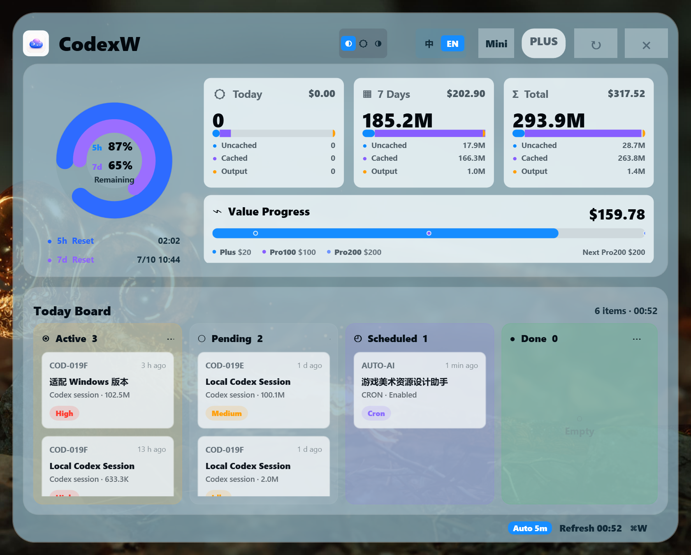
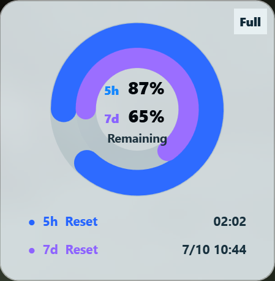

# CodexW

<p align="center">
  <strong>English</strong> / <a href="README.zh-CN.md">简体中文</a>
</p>

CodexW is a Windows-native desktop usage panel for Codex, adapted from
[`shanggqm/codexU`](https://github.com/shanggqm/codexU).

It keeps the visual style of codexU while running on stock Windows with
PowerShell and WPF. No Python, Node.js, sqlite3, Xcode, or .NET SDK is required.
It includes both the full dashboard and a Mini mode focused on the quota ring.

## UI Preview

### Full Mode



### Mini Mode



## Features

- Desktop panel with Codex usage statistics.
- Full dashboard mode and compact Mini mode.
- 5-hour and 7-day quota rings.
- Today, 7-day, and lifetime token/cost cards.
- Value progress bar for Plus, Pro100, and Pro200 thresholds.
- Local task board from Codex session logs and automations.
- Tray icon with a custom translucent right-click menu.
- Show/hide, refresh, desktop-bottom mode, launch-at-login, and quit actions.
- Optional 5-minute auto-refresh while Codex is running.
- Window position restore across restarts.
- Chinese and English UI toggle.
- Light, dark, and auto theme modes.

## Requirements

- Windows 10 or Windows 11.
- PowerShell 5.1 or later, included with Windows.
- Codex desktop/CLI local data under `%USERPROFILE%\.codex`.

## Quick Start

1. Download or clone this repository.
2. Double-click `CodexWLauncher.exe`. Use `Start-CodexW.cmd` only as a fallback.
3. Use the tray icon to show, hide, refresh, or quit CodexW.

The app reads local Codex JSONL session logs directly. It does not require a
background server and does not upload your local usage data.

## Files

```text
CodexWLauncher.exe           Native Windows launcher, included in release packages.
Start-CodexW.cmd             Fallback root launcher.
windows/CodexW.ps1           Main WPF app.
Resources/CodexW-icon.png    Tray and header icon.
docs/screenshot-*.png        README screenshots.
```

## Settings

CodexW stores only lightweight local UI settings:

```text
%LOCALAPPDATA%\CodexW\settings.json
```

Currently this stores the last panel position so the next launch can restore it.

## Diagnostics

From the repository root:

```powershell
powershell.exe -NoProfile -ExecutionPolicy Bypass -STA -File .\windows\CodexW.ps1 -DumpJson
```

This prints the local data snapshot used by the panel.

## Privacy

CodexW reads local files under `%USERPROFILE%\.codex` to display usage data.
It does not send this data anywhere.

## Attribution

CodexW is a Windows adaptation of `shanggqm/codexU`. The original MIT license is
preserved in `LICENSE`, and source attribution is listed in `NOTICE.md`.

## License

MIT.


