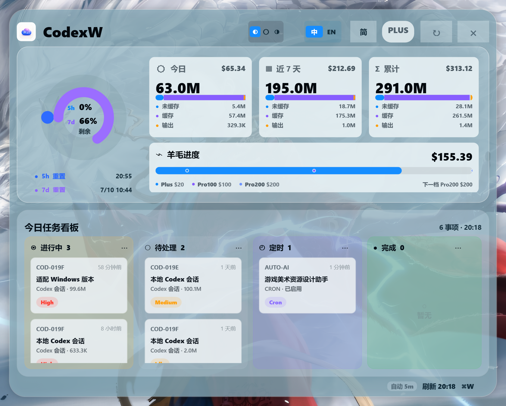
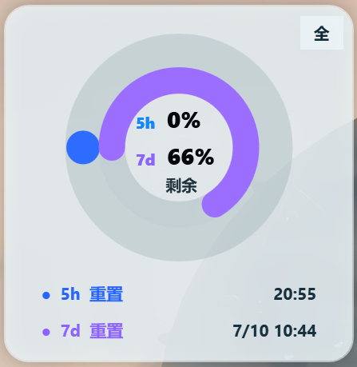

# CodexW

<p align="center">
  <a href="README.md">English</a> / <strong>简体中文</strong>
</p>

CodexW 是一个 Windows 原生 Codex 用量桌面面板，基于
[`shanggqm/codexU`](https://github.com/shanggqm/codexU) 适配而来。

它尽量保留 codexU 的视觉风格，同时使用 Windows 自带的 PowerShell 和 WPF
运行。不需要安装 Python、Node.js、sqlite3、Xcode 或 .NET SDK。
它同时提供完整仪表盘和只显示额度圆环的简洁模式。

## 界面预览

### 完整模式



### 简洁模式



## 功能

- Codex 用量桌面常显面板。
- 完整仪表盘模式和紧凑简洁模式。
- 5 小时和 7 天额度圆环。
- 今日、近 7 天和累计 token/费用统计卡。
- Plus、Pro100、Pro200 阈值对应的羊毛进度条。
- 从本地 Codex session 日志和 automations 生成任务看板。
- 系统托盘图标和半透明自绘右键菜单。
- 显示/隐藏、刷新、贴在桌面底层、开机自启动和退出。
- Codex 运行时可每 5 分钟自动刷新一次。
- 记住上一次窗口所在的屏幕位置，重新打开时自动恢复。
- 中文和英文界面切换。
- 自动、浅色和深色显示模式。

## 使用要求

- Windows 10 或 Windows 11。
- Windows 自带 PowerShell 5.1 或更高版本。
- 本机存在 Codex 数据目录 `%USERPROFILE%\.codex`。

## 快速开始

1. 下载或克隆此仓库。
2. 双击 `CodexWLauncher.exe`。`Start-CodexW.cmd` 可作为备用启动方式。
3. 通过系统托盘图标显示、隐藏、刷新或退出 CodexW。

CodexW 会直接读取本机 Codex JSONL session 日志，不需要启动后台服务，也不会上传你的本地用量数据。

## 文件

Release 压缩包只包含运行 CodexW 所需的文件：

```text
CodexWLauncher.exe         推荐使用的原生 Windows 启动器。
Start-CodexW.cmd           备用启动器，主要用于排查启动问题。
windows/CodexW.ps1         PowerShell/WPF 主程序。
Resources/CodexW-icon.ico  启动器、窗口和托盘图标。
Resources/CodexW-icon.png  标题区和托盘图像源。
```

以下内容只属于 GitHub 仓库，用于页面展示或开发维护，不会打进 Release 压缩包：

```text
docs/screenshot-*.png      README 页面预览截图。
tools/CodexWLauncher.cs    原生启动器源码。
README*.md, LICENSE, ...   仓库文档和元数据。
```

## 本地设置

CodexW 只保存轻量界面设置：

```text
%LOCALAPPDATA%\CodexW\settings.json
```

目前主要用于保存面板上一次所在的屏幕位置。

## 诊断

在仓库根目录运行：

```powershell
powershell.exe -NoProfile -ExecutionPolicy Bypass -STA -File .\windows\CodexW.ps1 -DumpJson
```

这会输出面板使用的本地数据快照。

## 隐私

CodexW 只读取 `%USERPROFILE%\.codex` 下的本地文件来展示用量，不会发送这些数据。

## 来源

CodexW 是 `shanggqm/codexU` 的 Windows 适配版本。原项目 MIT 许可证保留在
`LICENSE`，来源说明见 `NOTICE.md`。

## 许可证

MIT。

